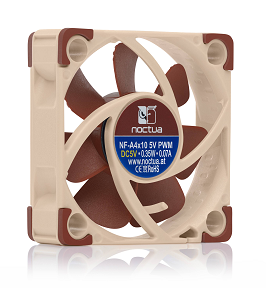
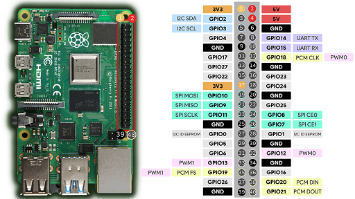

# PWM controlled fan for Raspberry PI 4B
_(should be good even for PI 3 model)_

## Introduction
I bought a Rpi 4B a while ago and since this model heats up a bit, I bought the official case with a 3-pin 25mm fan. Unfortunately, this fan makes a lot of noise and everyone in my household (including the dog) is annoyed...

So, I decided to spend a few euros to get a nice and silent fan and control it using PWM natively supported by the Rpi. Being quite new to Rpi tweaking, I found a lot of information on the Internet, some are shared below in the "Further reading" section.

My solution:
- PWM 5V fan
- pigpio library
- bash script (using the pigpio command `pigs`)

## Stuff needed
- A Raspberry PI...
- A case allowing to insert the fan of your choice. I got the GeekPi case from A....n for 17 €
- A PWM fan. I bought the Noctua NF-A4x10 5V PWM for 16 €. /!\ MUST BE A 5V FAN
- Jumper wires; 6 € for a un bunch of 40 pieces.

## Installing dependencies
Check if pigpiod and pigs are available on you Rpi:
- `whereis pigpiod`
- `whereis pigs`

On my Rpi 4B with Raspian, these were available right after installing the OS.

If not already available, check intallation insctruction [here](https://abyz.me.uk/rpi/pigpio/download.html).

## Setting up the script
Download or copy the script `rpi_pwm_fan_control.sh` from this repo. Put it wherever you want it but make sure it is executable: `sudo chmod a+x /path/to/rpi_pwm_fan_control.sh`.

Change the constants in the script to suit your needs. The script is well commented so you should have no problem doing this. You can tryout your settings by running manually your script.

Without the script you can try your set-up using:
```
#!/bin/bash
GPIO=18 # GPIO 18 (pin 12)
FREQ=25000 # 25 kHz (see specifications for your fan)
DUTY_CYCLE=50 # 50% duty cycle
pigs HP $GPIO $FREQ $((DUTY_CYCLE*10000)) # Will output command pigs HP 18 25000 500000
```

## Connect fan (example for Noctua nf-a4x10 5v PWM fan)
/!\ Shut down your Rpi before messing with the pins!!!




- 5V
- GND
- GPIO18 (PWM0)

For pinout, see https://randomnerdtutorials.com/raspberry-pi-pwm-python/

## Run at boot
As root (or using sudo):
- enable the pigpiod service so it starts automatically upon reboot: `systemctl enable pigpiod`
- start the service `systemctl start pigpiod`
- To run the script at boot, edit the crontab: `crontab -e` and add the line `@reboot /path/to/rpi_pwm_fan_control.sh` at the end of the file

Be sure the crond service is enabled (`sudo systemctl status cron.service`) or enable it: `sudo systemctl enable cron.service`.

## Further reading
- https://abyz.me.uk/rpi/pigpio/pigs.html#M/MODES
- https://blog.driftking.tw/en/2019/11/Using-Raspberry-Pi-to-Control-a-PWM-Fan-and-Monitor-its-Speed/
- https://www.the-diy-life.com/connecting-a-pwm-fan-to-a-raspberry-pi/
- https://randomnerdtutorials.com/raspberry-pi-pwm-python/


